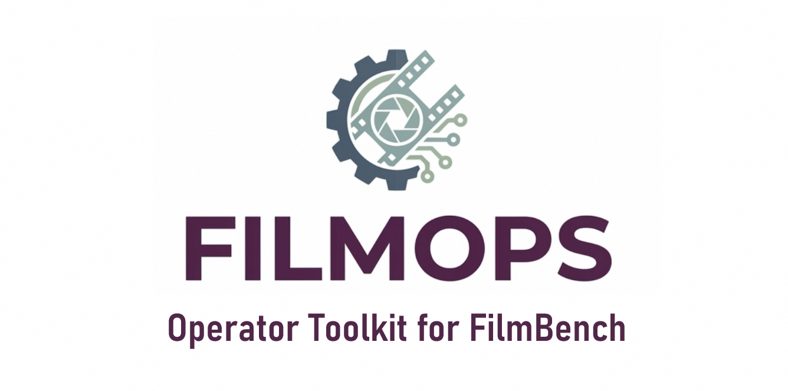
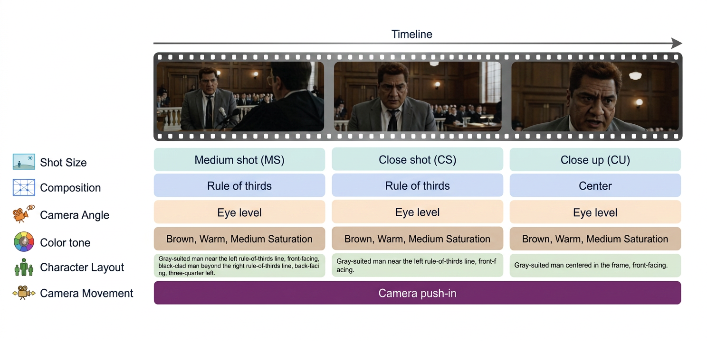

<p align="center">
  
</p>

<p align="center">
  <a href="https://arxiv.org/pdf/2607.24241">
    
  </a>
  <a href="https://huggingface.co/Neo961/FilmOps">
    
  </a>
  <a href="https://huggingface.co/datasets/Neo961/FilmOps">
    
  </a>
</p>

## Overview

Existing video generation benchmarks focus on general perceptual quality but remain coarse-grained when it comes to professional cinematographic language — general-purpose MLLMs struggle with film-specific attributes, and domain expert models (e.g., aesthetic predictors) suffer from a significant domain gap with cinematic content. **FilmOps** bridges this gap: an open-source operator suite that maps video frames into structured cinematographic labels across six core dimensions, with all category definitions aligned to industry-standard references and validated by practitioners.

<p align="center">
  
</p>

The suite covers six specialized operators across 55+ subcategories, each using a task-specific backbone best suited for its visual characteristics:

| Dimension | Granularity | Classes | Backbone |
|-----------|-------------|---------|----------|
| **Shot Scale** | Frame | 8 (single-label) | DINO ViT-B/14 |
| **Composition** | Frame | 12 (multi-label) | DINO ViT-B/14 |
| **Camera Angle** | Frame | 7 (multi-label) | BEiT Base |
| **Color & Tone** | Frame | 18 (multi-label, 3 sub-axes) | ResNet-18 |
| **Character Layout** | Frame | Open (NL description) | InternVL3-14B |
| **Camera Movement** | Shot | 10 (multi-label) | InternVL3-14B |

## Key Features

- **Industry-aligned taxonomy** — categories follow professional cinematography standards (Film Art, ASC Manual, Cinematography: Theory and Practice), validated by industry practitioners.
- **Cross-genre consistency** — designed to generalize across a diverse mix of video genres, including live-action, 3D animation, 2D animation, and stylized content.
- **Task-specific design** — each operator uses the backbone best suited for its visual characteristics.
- **Modular architecture** — use individual operators independently or via the unified pipeline.
- **Outperforms general-purpose MLLMs** on all dimensions — see our paper for detailed evaluation results.

---

## Installation

```bash
git clone https://github.com/Neo-yk/FilmOps.git
cd FilmOps

conda create -n filmops python=3.10 -y
conda activate filmops

pip install -e .
```

### Requirements

- Python ≥ 3.9
- PyTorch ≥ 1.13 (with CUDA for MLLM operators)
- ffmpeg available on `PATH`

---

## Quick Start

### 1. Prepare checkpoints

Download model weights into `./checkpoints/` using the layout below. See [`checkpoints/README.md`](checkpoints/README.md) for details.

```
checkpoints/
├── shot_scale/
│   ├── dinov2_shot_scale.pth
│   └── dinov2_vitb14_pretrain.pth
├── composition/
│   ├── dinov3_composition.pth
│   └── dinov3_vitb16_pretrain_lvd1689m-73cec8be.pth
├── camera_angle/
│   ├── shot_angle/
│   └── dutch_shot/
├── color_tone/
│   └── resnet18_color_tone.pth
├── character_layout/
│   └── character_layout_ckpt/
└── camera_movement/
    └── camera_movement_ckpt/
```

Verify everything is in place:

```bash
python scripts/verify_install.py --ckpt-dir ./checkpoints
```

### 2. Run an example

```bash
# Single image
python examples/analyse_image.py --image frame.jpg --ckpt-dir ./checkpoints

# Camera movement (requires a video)
python examples/analyse_video.py --video shot.mp4 --ckpt-dir ./checkpoints --operators camera_movement

# Restrict to a subset
python examples/analyse_image.py --image frame.jpg --operators shot_scale,color_tone

# Character layout with reference crops
python examples/character_layout_multi_image.py \
    --frame frame.jpg --characters char0.jpg char1.jpg
```

### 3. Use in code

```python
from filmops import FilmOpsConfig, FilmOpsPipeline

cfg = FilmOpsConfig(
    checkpoint_dir="./checkpoints",
    device="cuda",
    enabled_operators=["shot_scale", "color_tone"],  # or None for all
)

pipe = FilmOpsPipeline(cfg)
pipe.load()

# Image analysis (frame-level operators)
result = pipe.analyse_image("frame.jpg")

# Video analysis (camera_movement)
result = pipe.analyse_video("shot.mp4")

print(result["shot_scale"]["labels"])    # e.g. ["Medium Shot"]
print(result["color_tone"]["labels"])    # e.g. ["Warm", "High Saturation", "Orange"]
```

---

## Project Structure

```
FilmOps/
├── filmops/                    # Python package
│   ├── core/                   # framework: BaseOperator / registry / Pipeline / types / exceptions
│   ├── config/                 # pipeline_config / operator_configs
│   ├── operators/              # six operators (each self-registers)
│   ├── backbones/              # internvl_loader / dinov2_loader / dinov3_loader / beit
│   ├── preprocessing/          # image / internvl_tiles
│   └── utils/                  # logging / io
├── examples/                   # user-facing example scripts
├── scripts/                    # download_checkpoints / verify_install
├── tests/                      # unit + integration tests
├── configs/                    # YAML config samples
├── checkpoints/                # model weights (download separately, see checkpoints/README.md)
├── pyproject.toml
├── requirements.txt
├── LICENSE
└── README.md
```

---

## Operator Notes

* **Color & Tone** — grayscale pre-check: if >80% of pixels are zero-saturation, the operator returns `["Low Saturation", "Monochrome"]` without running the network.
* **Character Layout** — two prediction modes: single-image (`op.predict("frame.jpg")`) or multi-image with character reference crops (`op.predict({"frame": "frame.jpg", "characters": ["char0.jpg"]})`). The pipeline always uses single-image mode; for multi-image, call the operator directly or use `examples/character_layout_multi_image.py`.
* **Camera Movement** — input is a video file; frames are sampled at 4 fps with a floor of 16 and ceiling of 56 segments.
* **MLLM operators** (Character Layout, Camera Movement) — checkpoint directories must contain `modeling_*.py` files (loaded via `trust_remote_code=True`).

---

## Taxonomy Details

<p align="center">
  
</p>

### Shot Scale
8 classes: Extreme Close-Up / Close-Up / Close Shot / Medium Shot / Medium Full Shot / Full Shot / Long Shot / Extreme Long Shot

### Composition
12 classes (multi-label): Center / Rule of Thirds / Horizontal / Vertical / Symmetric / Framing / Scattered / Leading Lines / Diagonal / Oblique / Triangular / Depth of Field

### Camera Angle
7 classes (multi-label): Eye Level / Low Angle / High Angle / Bird's Eye / Extreme Low Angle / Extreme High Angle / Dutch Angle

### Color & Tone
18 classes across 3 sub-axes:
- **Hue** (12): Red / Orange / Yellow / Green / Cyan / Blue / Purple / Magenta / Pink / Brown / Monochrome / White
- **Temperature** (3): Cool / Warm / Mixed
- **Saturation** (3): High Saturation / Medium Saturation / Low Saturation

### Character Layout
Natural language description of character positions and orientations.

### Camera Movement
10 classes (multi-label): Push In / Pull Out / Pan / Tracking / Static / Arc / Follow / Roll / Zoom / Dynamic

---

## Using Individual Operators

Every operator can be used standalone:

```python
from filmops.operators.color_tone import ColorToneOperator
from filmops.preprocessing.image import load_image

op = ColorToneOperator()
op.load(model_path="./checkpoints/color_tone/resnet18_color_tone.pth")

frame = load_image("test.jpg")
result = op.predict([frame])
print(result["labels"])
```

---

## License

The **FilmOps source code** is released under the Apache License 2.0. See [LICENSE](LICENSE).

### Third-party code bundled in `filmops/backbones/`

For convenience, FilmOps bundles minimal inference-only code extracted from the
following upstream projects. Each bundled sub-directory retains its original
copyright header and ships the corresponding license file:

| Component | Bundled path | Upstream | License |
|-----------|-------------|----------|--------|
| DINOv2 | `backbones/dinov2/` | [facebookresearch/dinov2](https://github.com/facebookresearch/dinov2) | Apache-2.0 ([LICENSE](filmops/backbones/dinov2/LICENSE)) |
| DINOv3 | `backbones/dinov3/` | [facebookresearch/dinov3](https://github.com/facebookresearch/dinov3) | DINOv3 License ([LICENSE.md](filmops/backbones/dinov3/LICENSE.md)) |
| BEiT | `backbones/beit.py` | [microsoft/unilm](https://github.com/microsoft/unilm) | Apache-2.0 (header in file) |
| InternVL | `backbones/internvl/` | [OpenGVLab/InternVL](https://github.com/OpenGVLab/InternVL) | MIT ([LICENSE](filmops/backbones/internvl/LICENSE)) |

> Only the subset of files required for inference is included; the full
> upstream repositories are **not** bundled.

### Model weights

Model weights are **not** included in this repository. They must be obtained
separately — see [`checkpoints/README.md`](checkpoints/README.md). The licenses
above cover **code only**; weights are governed by their own upstream licenses.
Review and comply with each before use, **especially for commercial deployment**:

| Component | Used by | Weight license |
|-----------|---------|---------------|
| DINOv2 | Shot Scale | Apache-2.0 |
| DINOv3 | Composition | **DINOv3 License — separate terms with usage restrictions; review carefully** |
| BEiT | Camera Angle | Apache-2.0 |
| InternVL3 | Character Layout, Camera Movement | see InternVL / base-model license |

> ⚠ Weights fine-tuned on a restricted backbone (e.g. the DINOv3-based
> Composition operator) inherit that backbone's license restrictions. It is the
> user's responsibility to verify the exact upstream terms before redistribution
> or commercial use.
